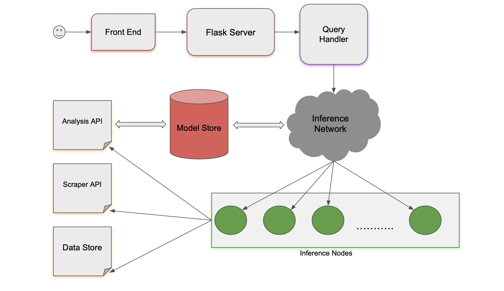

<p align="center">
     
</p> 

# NBA-Search

This is an NBA Analytics website with multiple components such as a chatbot, blogs, and predictions. All the data for the site is being scraped from [Basketball Reference](https://www.basketball-reference.com). This project is made possible by the hard working members of the open source community!

## System Design


## Building locally

1. Clone the repository locally:
   ```
   git clone https://github.com/skekre98/NBA-Search.git
   ```

2. Run the following command to set up all necessary dependencies:
   ```
   ./setup.sh
   ```
   - you will likely need to give the setup script permission to execute

3. Run the following command to deploy the web app on your localhost:
   ```
   python main.py run
   ```
<p align="center">
     
</p>

4. Run the following command to run the unit tests:
   ```
   python main.py test
   ```
   You can also add you own unit tests in *test.py*

## Contributing

There is a lot to do so contributions are really appreciated! This is a great project for early stage developers to work with.

To begin it is recommended starting with issues labelled [good first issue](https://github.com/skekre98/NBA-Search/issues?q=is%3Aissue+is%3Aopen+label%3A%22good+first+issue%22).


How to get started:

1. Fork the NBA-Search repo.
2. Create a new branch in you current repo from the 'master' branch with issue label.
3. 'Check out' the code with Git or [GitHub Desktop](https://desktop.github.com/)
4. Check [contributing.md](CONTRIBUTING.md)
5. Push commits and create a Pull Request (PR) to NBA-Search

## Dependencies
* [Flask](https://flask.palletsprojects.com/en/1.1.x/) - The framework used to build the web app.
* [Beautiful Soup](https://www.crummy.com/software/BeautifulSoup/bs4/doc/) - The HTML parser used for web scraping.
* [Sklearn](https://scikit-learn.org/stable/) - The machine learning library used to implement information retrieval.
* [Pandas](https://pandas.pydata.org/docs/) - The python library used for data manipulation.
